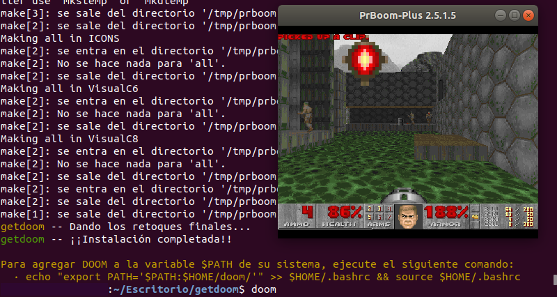

# Instalador `getdoom.sh`
`getdoom.sh` es un pequeño script escrito para automatizar la compilación e instalación del popular juego **DOOM** (su implementación **PrBoom+**) en máquinas **LINUX** (preferiblemente aquellas basadas en **Debian** o derivados).

Como es obvio, este pequeño programa no aporta nada nuevo más allá de automatizar un proceso que es rápido de por sí, pues todo el trabajo de verdad ha sido realizado por los desarrolladores de el port [PrBoom+](https://prboom-plus.sourceforge.io/), que es el aquí utilizado, por lo que visitad su página si queréis investigar más.

### Cómo ejecutar el programa
En sí, siempre puede clonar el repositorio y luego ejecutar `getdoom.sh` mediante los siguientes comandos:
```bash
git clone https://github.com/soyeltata/getdoom.sh.git
cd getdoom.sh
bash ./getdoom.sh
```
Lo cual debería de producir el comportamiento esperado, mas se trata de un proceso un tanto lento, que puede ser acortado a un solo comando:
```
source <(curl -s https://raw.githubusercontent.com/soyeltata/getdoom.sh/main/getdoom.sh)
```
Este comando debería de producir este mismo comportamiento y, ahora sí, ejecutar el instalador de **DOOM** en su máquina, si encuentras algún bug siempre puedes realizar una contribución.

<div align="center">
  
</div>
